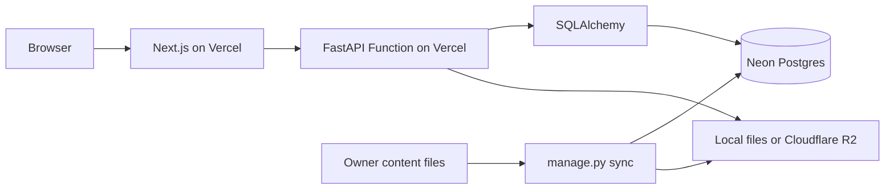

# NotesNest architecture

## Overview

NotesNest is a read-only study-material site with no authentication, accounts,
uploads, or global search. Courses, faculty, and advice are self-contained
sections. The owner edits content files and runs the sync commands; the app
serves the resulting database records. Local development stays simple while
the production database and PDF storage can be managed services.

## Backend layout

| Group | Responsibility |
| --- | --- |
| `api` | FastAPI router and course, resource, faculty, and article endpoints |
| `core` | Settings, environment values, and S3 configuration validation |
| `db` | SQLAlchemy declarative base and lazy database sessions |
| `models` | Database entities and the term-subject association table |
| `schemas` | Pydantic response models |
| `services` | Local path protection and S3 presigned-file responses |

## Data model

- `Term` stores a fall or winter semester and links to `Subject` through
  `term_subjects`.
- `Subject` is identified by its unique course code and can appear in many
  terms.
- `Resource` belongs to a `Subject`, never to a `Term`, and represents a PYQ
  or note PDF.
- `Faculty` is an independent directory entry.
- `Article` stores one advice article imported from Markdown.

## API reference

| Method | Endpoint | Query parameters | Response |
| --- | --- | --- | --- |
| GET | `/api/v1/health` | — | Health status |
| GET | `/api/v1/terms` | — | Terms, newest first |
| GET | `/api/v1/terms/{id}` | — | One term or 404 |
| GET | `/api/v1/subjects` | `term_id` optional | Subjects |
| GET | `/api/v1/subjects/{id}` | — | One subject or 404 |
| GET | `/api/v1/resources` | `subject_id`, `type` optional | Resources without paths |
| GET | `/api/v1/resources/{id}/file` | `download=1` optional | Local PDF or R2 redirect |
| GET | `/api/v1/faculty` | — | Faculty ordered by name |
| GET | `/api/v1/articles` | `category` optional | Article summaries |
| GET | `/api/v1/articles/{slug}` | — | Full article or 404 |

## Content workflow

| Content | Location and format | Command |
| --- | --- | --- |
| Courses and terms | `backend/data/courses.json` | `sync-courses` |
| PDFs | `backend/storage/<CODE>/pyq` or `notes` | `sync-files` |
| Faculty | `backend/data/faculty.json` | `sync-faculty` |
| Advice | `backend/data/advice/*.md` | `sync-advice` |

`python -m app.manage sync` runs all four imports in order. Local PDFs are
uploaded to R2 when `STORAGE_BACKEND=s3`; database rows and R2 objects removed
from the local source are removed during that sync. Real faculty data and PDFs
are gitignored.

## Frontend structure

- `/` — semester selection
- `/terms/[termId]` — subjects and the client-side subject filter
- `/subjects/[subjectId]` — PYQ and notes tabs
- `/faculty` — searchable expandable faculty directory
- `/advice` — category-filtered article list
- `/advice/[slug]` — rendered Markdown article

Shared UI lives in `frontend/src/components`; API types and the fetch helper
live in `frontend/src/lib`.

## Production architecture and caching

The frontend and backend are separate Vercel projects. The backend uses a
Neon Postgres connection and Cloudflare R2 presigned GET URLs for private PDFs.
The file endpoint redirects to a five-minute signed URL and marks its redirect
`no-store`. Other successful API GET responses, except health, use
`s-maxage=300` and `stale-while-revalidate=600`; after publishing, content can
take about five minutes to appear from cache.

## Key decisions and trade-offs

- SQLite is the zero-setup local database; SQLAlchemy models remain
  Postgres-ready.
- Storage is selected by `STORAGE_BACKEND`: local path resolution for
  development or S3-compatible presigned URLs for R2.
- Sync commands mirror content sources instead of introducing an admin UI.
- The frontend fetches client-side to keep the app small and straightforward.
- There is no global search because each section has a focused local browsing
  experience.

## Planned work

- Add AI features using retrieval-augmented generation over notes and PYQs.
- Complete the first production deployment to Vercel.
