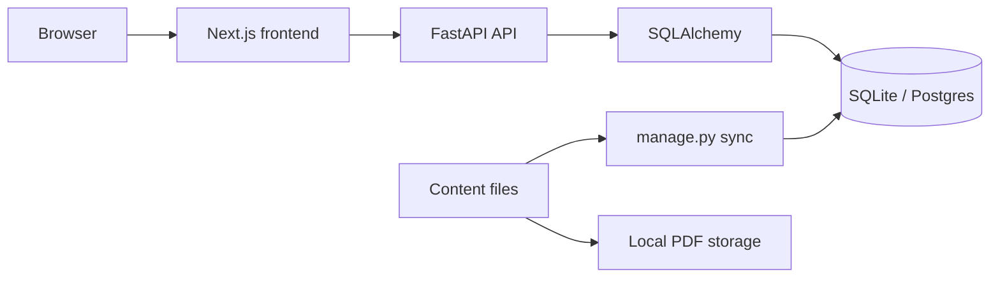

# NotesNest architecture

## Overview

NotesNest is a small, read-only study-material site. It has no authentication,
accounts, uploads, or global search. Each section is self-contained: course
navigation, faculty, and advice are independent reads. Content is maintained as
files by the owner and imported with the management CLI. The design favors
simple modules and portable database models over premature abstraction.

## Backend layout

| Group | Responsibility |
| --- | --- |
| `api` | FastAPI router and resource, course, faculty, and article endpoints |
| `core` | Application settings and environment configuration |
| `db` | SQLAlchemy declarative base and database sessions |
| `models` | Database entities and the term-subject association table |
| `schemas` | Pydantic response models |
| `services` | Storage-root path resolution and traversal protection |

## Data model

- `Term` stores a fall or winter semester and links to `Subject` through
  `term_subjects`.
- `Subject` is identified by its unique course code. A subject can appear in
  many terms.
- `Resource` belongs to a `Subject`, never to a `Term`, and represents a PYQ or
  note PDF.
- `Faculty` is an independent directory entry and is not linked to subjects.
- `Article` stores one advice article imported from a Markdown file.

## API reference

| Method | Endpoint | Query parameters | Response |
| --- | --- | --- | --- |
| GET | `/api/v1/health` | — | Health status |
| GET | `/api/v1/terms` | — | Terms, newest first |
| GET | `/api/v1/terms/{id}` | — | One term or 404 |
| GET | `/api/v1/subjects` | `term_id` optional | Subjects |
| GET | `/api/v1/subjects/{id}` | — | One subject or 404 |
| GET | `/api/v1/resources` | `subject_id`, `type` optional | Resources without file paths |
| GET | `/api/v1/resources/{id}/file` | `download=1` optional | PDF inline or as download |
| GET | `/api/v1/faculty` | — | Faculty ordered by name |
| GET | `/api/v1/articles` | `category` optional | Article summaries |
| GET | `/api/v1/articles/{slug}` | — | Full article or 404 |

## Content workflow

| Content | Location and format | Command |
| --- | --- | --- |
| Courses and terms | `backend/data/courses.json` | `python -m app.manage sync-courses` |
| PDFs | `backend/storage/<CODE>/pyq` or `notes`, PDF files | `python -m app.manage sync-files` |
| Faculty | `backend/data/faculty.json`, copied from the example JSON | `python -m app.manage sync-faculty` |
| Advice | `backend/data/advice/*.md` with simple frontmatter | `python -m app.manage sync-advice` |

`python -m app.manage sync` runs all four imports in order. Course and article
syncs mirror their source files; PDF sync treats files as the source of truth.
Real faculty data and PDFs are gitignored.

## Frontend structure

The Next.js App Router pages are:

- `/` — semester selection
- `/terms/[termId]` — subjects and the client-side subject filter
- `/subjects/[subjectId]` — PYQ and notes tabs
- `/faculty` — searchable expandable faculty directory
- `/advice` — category-filtered article list
- `/advice/[slug]` — rendered Markdown article

Shared UI lives in `frontend/src/components`; API types and the fetch helper
live in `frontend/src/lib`.

## Key decisions and trade-offs

- SQLite is the zero-setup local database; SQLAlchemy models remain
  Postgres-ready.
- PDF lookup is isolated in `services/storage.py`, so local files can later be
  replaced by blob storage.
- Sync commands are explicit and mirror content sources instead of introducing
  an admin interface.
- The frontend fetches client-side to keep the app small and straightforward.
- There is no global search because each section has a focused, local browsing
  experience and the project does not need cross-content search yet.

## Planned work

- Add AI features using retrieval-augmented generation over notes and PYQs.
- Deploy the frontend to Vercel when hosting work begins.
